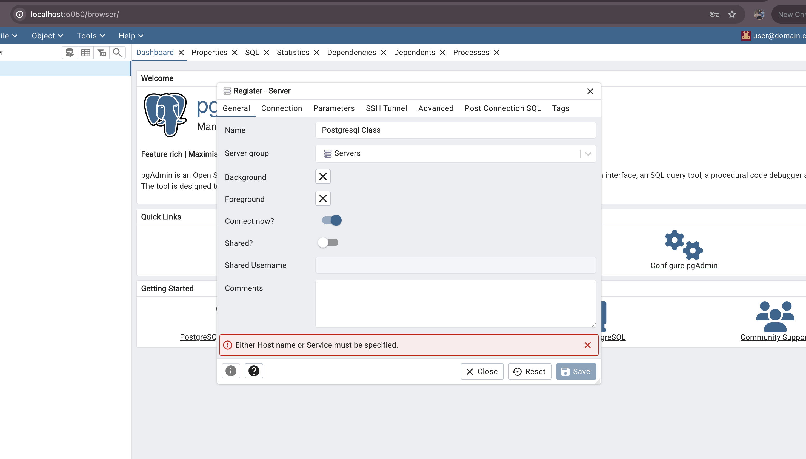

# Parameter Tuning

- **Parameter Tuning**
    - configuration มีหลายตัวที่ค่า default อาจจะไม่เหมาะสมกับการใช้งาน สังเกตุได้จากการดู monitor ของ database ของเรา สิ่งที่อาจจะพบบ่อยๆ เช่น IO peek เป็นต้น
        
        ตัวอย่าง
        
        - work_mem ใช้สำหรับการ order ,distinct, merge joins ฯลฯ default 4MB ถ้ามีค่าน้อยเกินไป การที่ต้องเรียงข้อมูลขนาดใหญ่อาจจะทำงานได้ช้าและจะใช้ในแต่ละ query หมายความว่าถ้า config ไว้มากเกินไปแล้วมีการดึง query ถี่ๆ อาจจะเบียดเบียน memory ในส่วนอื่นๆ จะแปรผันตาม จำนวน max connection
        - shared_buffers เป็น buffer ชั่วคราวที่ใช้สำหรับ ดึงข้อมูล การดึงข้อมูลจะมาดูที่ shared_buffers ก่อนถ้าไม่มีแล้วค่อยจะไปหาที่ disk ซึ่งจะช่วยลด I/O operation ได้ default 128MB แนะนำให้ปรับที่ 25% of ram
    
    LAB
    
   
    
    ```bash
    cd  module-3/parameter-tuning
    docker compose up -d
    ```
    
    เข้าหน้าเว็บ PGAdmin
    
    ```bash
    http://localhost:5050/browser/
    ```
    
    Add new server
    
    
    
    Tab Connection
    
    
    
    กด Save
    
    
    
    เปิด terminal เพื่อ ssh เข้า ubuntu server 
    
    ```bash
    docker exec -it ubuntu bash
    ```
    
    update package และ install postgresql
    
    ```bash
    apt update && apt install postgresql
    ```
    
    ```bash
    After this operation, 364 MB of additional disk space will be used.
    Do you want to continue? [Y/n] Y
    ```
    
    ```
    Please select the geographic area in which you live. Subsequent configuration questions will narrow this down by presenting a list of cities, representing the time zones in which they are located.
    
      1. Africa  2. America  3. Antarctica  4. Arctic  5. Asia  6. Atlantic  7. Australia  8. Europe  9. Indian  10. Pacific  11. Etc  12. Legacy
    Geographic area: 5
    ```
    
    ```
    Please select the city or region corresponding to your time zone.
    
      1. Aden    7. Ashgabat  13. Barnaul     19. Chongqing  25. Dushanbe     31. Hong_Kong  37. Jerusalem  43. Khandyga      49. Macau     55. Novokuznetsk  61. Pyongyang  67. Samarkand      73. Tashkent  79. Tomsk        85. Yakutsk
      2. Almaty  8. Atyrau    14. Beirut      20. Colombo    26. Famagusta    32. Hovd       38. Kabul      44. Kolkata       50. Magadan   56. Novosibirsk   62. Qatar      68. Seoul          74. Tbilisi   80. Ulaanbaatar  86. Yangon
      3. Amman   9. Baghdad   15. Bishkek     21. Damascus   27. Gaza         33. Irkutsk    39. Kamchatka  45. Krasnoyarsk   51. Makassar  57. Omsk          63. Qostanay   69. Shanghai       75. Tehran    81. Urumqi       87. Yekaterinburg
      4. Anadyr  10. Bahrain  16. Brunei      22. Dhaka      28. Harbin       34. Istanbul   40. Karachi    46. Kuala_Lumpur  52. Manila    58. Oral          64. Qyzylorda  70. Singapore      76. Tel_Aviv  82. Ust-Nera     88. Yerevan
      5. Aqtau   11. Baku     17. Chita       23. Dili       29. Hebron       35. Jakarta    41. Kashgar    47. Kuching       53. Muscat    59. Phnom_Penh    65. Riyadh     71. Srednekolymsk  77. Thimphu   83. Vientiane
      6. Aqtobe  12. Bangkok  18. Choibalsan  24. Dubai      30. Ho_Chi_Minh  36. Jayapura   42. Kathmandu  48. Kuwait        54. Nicosia   60. Pontianak     66. Sakhalin   72. Taipei         78. Tokyo     84. Vladivostok
    Time zone: 12
    ```
    
    **Initialize Data**
    
    ```bash
     PGPASSWORD=mypassword pgbench -h db -p 5432 -U myuser  -i -s 100  mydatabase
    ```
    
    ### work_mem
    
           work_mem ใช้สำหรับการ order ,distinct, merge joins ฯลฯ default 4MB ถ้ามีค่าน้อยเกินไป การที่ต้องเรียงข้อมูลขนาดใหญ่อาจจะทำงานได้ช้าและจะถูกใช้ในแต่ละ query หมายความว่าถ้า config ไว้มากเกินไปแล้วมีการดึง query จำนวนมาก อาจจะทำให้การใช้ memory โดยรวมสูงมากขึ้น ซึ่งจะแปรผันตาม จำนวน max connection
    
    สูตรคำนวน work_mem  
    
    จาก Microsoft
    
    `work_mem = Total RAM / Max Connections / 16`
    
    ```sql
    work_mem = (8 * 1024) /400 /16 = 1.28MB
    ```
    
    ref: [https://techcommunity.microsoft.com/blog/adforpostgresql/optimizing-query-performance-with-work-mem/4196408](https://techcommunity.microsoft.com/blog/adforpostgresql/optimizing-query-performance-with-work-mem/4196408)
    
    จาก Enterpisedb
    
    ```
    work_mem = (Total RAM × 0.25) ÷ max_connections
    ```
    
    [https://www.enterprisedb.com/postgres-tutorials/how-tune-postgresql-memory](https://www.enterprisedb.com/postgres-tutorials/how-tune-postgresql-memory)
    
    ```sql
    create table big_data (
      id INT,
      txt VARCHAR(255)
    );

    INSERT INTO  big_data(id, txt)
    SELECT i, md5(i::text) AS txt
    FROM generate_series(1, 1000000) AS s(i); 
    
    SET work_mem = '2MB'; -- ประมาณ 
    
    EXPLAIN (ANALYZE, BUFFERS)
    SELECT * FROM big_data ORDER BY txt;
    ```
    
    จาก Sort Method: external merge  Disk: 4632kB มีการเขียนลง disk แสดงว่า work_mem
    
    ```
    Sort  (cost=13631.41..13896.20 rows=105918 width=36) (actual time=139.075..162.465 rows=100000 loops=1)
      Sort Key: txt
      Sort Method: external merge  Disk: 4632kB
      Buffers: local hit=834, temp read=579 written=584
      ->  Seq Scan on big_data  (cost=0.00..1893.18 rows=105918 width=36) (actual time=0.067..8.566 rows=100000 loops=1)
            Buffers: local hit=834
    Planning Time: 0.422 ms
    Execution Time: 168.801 ms
    ```
    
    ถ้าอยากให้ไม่มีการ เขียนข้อมูลลง disk ต้อง set work_mem เป็นเท่าไหร่ ?
    
    ```sql
    SET work_mem = '100MB'; 
    
    Sort  (cost=10733.41..10998.20 rows=105918 width=36) (actual time=110.606..114.797 rows=100000 loops=1)
      Sort Key: txt
      Sort Method: quicksort  Memory: 10176kB
      Buffers: local hit=834
      ->  Seq Scan on big_data  (cost=0.00..1893.18 rows=105918 width=36) (actual time=0.053..9.563 rows=100000 loops=1)
            Buffers: local hit=834
    Planning Time: 0.492 ms
    Execution Time: 118.216 ms
    ```
    
    จากที่เราคำนวนได้แล้ว พิจารณาว่า เราปรับลดส่วนไหนได้บ้าง
    
    ```
    work_mem = (8 * 1024) /400 /16 = 1.28MB
    
    --- ปรับ
    work_mem = (650 * 1024) /400 /16 = 104MB
    ```
    
    - ลด max_connections ? กระทบอะไรบ้าง
    - เพิ่ม ram ขึ้นมากขึ้นจากเดิม 8 GB เป็น 650
    - รับความเสี่ยงจาก memory ที่อาจจะพุ่งขึ้นสูงได้
    
    ### shared_buffers
    
         shared_buffers เป็น buffer ชั่วคราวที่ใช้สำหรับ ดึงข้อมูล การดึงข้อมูลจะมาดูที่ shared_buffers ก่อนถ้าไม่มีแล้วค่อยจะไปหาที่ disk ซึ่งจะช่วยลด I/O operation ได้ default 128MB แนะนำให้ปรับที่ 25% of ram
    
    ลอง Query โดยใช้ vs code
    
    ```sql
    select * from pgbench_accounts WHERE aid < 5500000; -- ตั้ง fetch ทุก 1s
    ```
    
    
    
    
    
    จะเห็นว่าหลังจากอ่านข้อมูลไประยะหนึ่ง หลังจากนั้นจะอ่านข้อมูลจาก cache สังเกตได้จากจำนวน Hits และ Reads :0 แสดงว่าข้อมูลที่อ่านได้ยังไม่เกินจำนวน Cache buffer ที่เก็บได้
    
    ปรับ query เพิ่มจำนวนการ query ข้อมูลเป็น 6,000,000
    
    ```sql
    select * from pgbench_accounts WHERE aid < 6000000;
    ```
    
    จะพบว่ามีการดึงข้อมูลจาก Disk มากขึ้น ดูจาก Reads: 71K
    
    
    
    ใช้ pgbench ในการ load test
    
    ```
    pgbench parameter
    
    -j : จำนวนของ Threads
    
    -c : จำนวน concurrent
    
    -S : บอกให้ pgbench ทำการใช้คำสั่ง select เท่านั้น
    
    -T : ระยะเวลาที่ต้องการทดสอบ
    
    ```
    
    เปิด ubuntu testminal 
    
    ```bash
    PGPASSWORD=mypassword pgbench -h db -p 5432 -U myuser mydatabase   -j 10 -c 100 -S   -T 60
    ```
    
    จะพบว่า มีการ read จาก disk ค่อนข้างมาก
    
    
    
    จากที่เราเคยได้รู้กันมาแล้วว่า shared_buffers เป็น buffer ชั่วคราวที่ใช้สำหรับ ดึงข้อมูล การดึงข้อมูลจะมาดูที่ shared_buffers ก่อนถ้าไม่มีแล้วค่อยจะไปหาที่ disk ซึ่งจะช่วยลด I/O operation ได้ default 128MB แนะนำให้ปรับที่ 25% of ram
    
    จากที่เรา config ให้ postgresql มี ram 8G เราจะเพิ่ม config สำหรับ shared_buffers เป็น 2GB
    
    ```yaml
    services:
      db:
        image: postgres:13
        restart: always
        environment:
          POSTGRES_USER: myuser
          POSTGRES_PASSWORD: mypassword
          POSTGRES_DB: mydatabase
        command: >
          postgres
          -c max_connections=400
          -c shared_buffers=2GB
          -c timezone='Asia/Bangkok'
        deploy:
          resources:
            limits:
              cpus: "2"
              memory: "8G"
            reservations:
              cpus: "2"
              memory: "500M"
        volumes:
          - ./db_data:/var/lib/postgresql/data
        ports:
          - "5432:5432"
    ```
    
    หลังจากนั้น restart service
    
    ```bash
    ## PostgreSQL_class/module-3/parameter-tuning
    
    docker compose down db && docker compose up db -d
    ```
    
    ทดสอบว่า config ถูกแก้ไขหรือไม่
    
    ```sql
    SHOW shared_buffers;
    
    --- 2GB
    ```
    
    จะพบว่าอันตราการ Read จาก disk ลดลงมาก และได้ performance เพิ่มขึ้นด้วย จากเดิม อยู่ราว ๆ 600k  
    
    
    
    ---
    
    ---
    
    Note
    
    - อยากเห็น case query concerent สูงแต่ไม่ทะลุ buffer อธิบายเรื่องที่ทำไม I/O ถึง พุ่ง แล้วเคสไหนไม่พุ่ง
    - อะไรที่เป็นต้วบอกว่าต้องเพิ่ม work_mem แล้ว